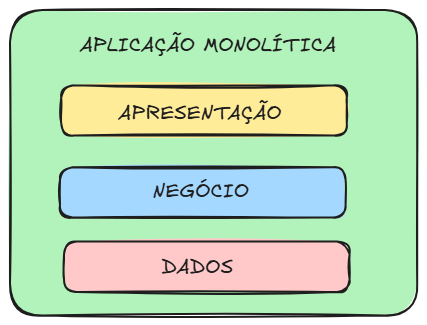

# 💰 Salário

Trata-se de uma aplicação web baseada em JSF, integrada a um banco de dados relacional. O sistema implementa autenticação de usuários e oferece funcionalidades para exibição de dados pessoais — incluindo salários consolidados — tanto em tela quanto por meio de relatórios. Também dispõe de uma funcionalidade dedicada ao cálculo automático dos salários.


## 🧱 Arquitetura

Esta aplicação segue uma arquitetura em camadas simples. O objetivo é manter a simplicidade sem abrir mão de boas práticas como a separação de responsabilidades e facilidade de testes e manutenção.



## 🧹 Qualidade
Neste projeto, utilizei o SonarQube e executei teste de sistema considerando não apenas o caminho feliz, mas também cenários de falha.


## 🛠️ Tecnologias

| Tecnologia   | Versão    |
|--------------|-----------|
| Java         | 8         |
| JSF (Mojarra)| 2.2.17    |
| PostgreSQL   | 17.5      |
| Hibernate    | 4.3.8     |
| PrimeFaces   | 7.0       |
| JUnit        | 4.13.2    |
| JasperReports| 7.0.3     |

## 📦 Itens que foram implementados

✅ Listagem de Pessoas, onde deve constar as informações
consolidadas na tabela pessoa_salario_consolidado, após a realização do cálculo
dos salários;

✅ Implementação do cálculo dos salários das pessoas, com uma opção na tela acima
para calcular / recalcular salários;

✅ Utilizar processamento assíncrono no cálculo dos salários;

✅ Criar um relatório, utilizando JasperReports, para exibição das pessoas e seus
salários calculados e exportação em PDF;

✅ Criar um CRUD de usuário e implementar autenticação via Login e Senha;

✅ Criar testes de unidade (leve uso).

## 🚀 Instruções para execução em um ambiente local

⚠️ O Hibernate está configurado para gerar automaticamente o schema, mas crie um banco de dados vazio antes com o nome **salario**.


### Pré-condições
#### 1. IDE com Tomcat **9.0** configurado
#### 2. Banco de dados **17.5** PostgreSQL disponível (secrets usadas para desenvolvimento local disponíveis em persistence.xml)


### Passo a passo

#### 1. Faça um clone deste repositório
 ```bash
   https://github.com/thejeremias/salario.git
```

#### 2. Importe no seu IDE como um projeto Maven (faça um Maven reload, se necessário)

#### 3. Adicione o projeto ao Tomcat configurado na sua IDE

#### 4. Inicie o Tomcat (assim que concluir, a aplicação está disponível em http://localhost:8080/salario ou em outro caminho especificado no seu servidor)
